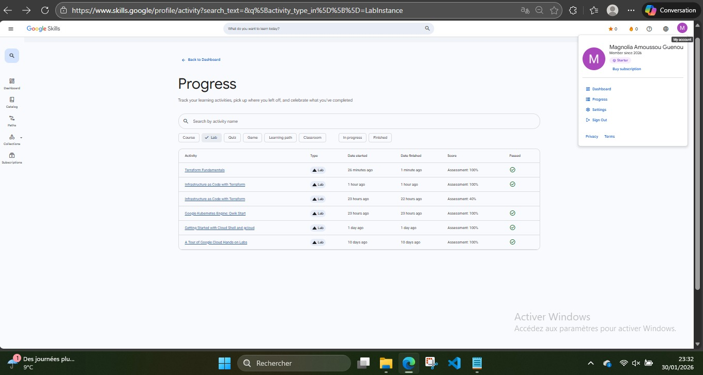
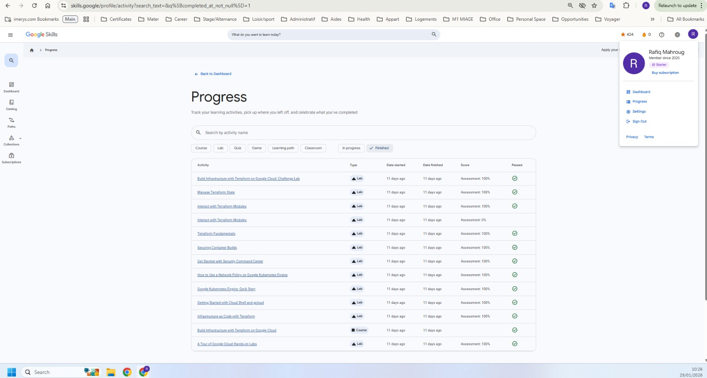
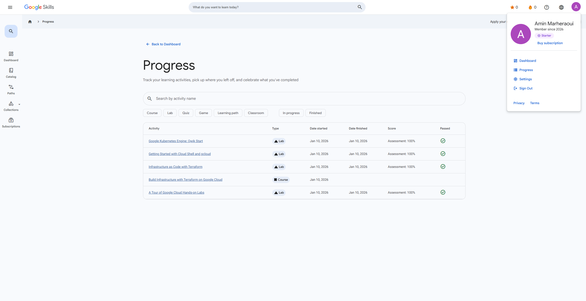

# Projet DevOps – Ville de Paris (Microservices & Kubernetes)

## Auteurs

Projet réalisé en trinôme par :

* **Magnolia AMOUSSOU GUENOU**
* **Rafiq MAHROUG**
* **Amin MARHERAOUI BERRAHHOU**

---

## Objectif du projet

Réaliser une application complète basée sur une **architecture microservices**, conteneurisée avec **Docker** et orchestrée avec **Kubernetes (Minikube)**.

Le projet respecte les consignes imposées :

* Microservices REST
* Docker / Kubernetes
* Gateway via Ingress
* Base de données
* Sécurisation Kubernetes (RBAC)
* Frontend moderne

---

## Description de l’application

Le projet **Ville de Paris** est une application web composée de :

### Frontend (React)

* Interface utilisateur moderne
* Inscription / Connexion
* Profil utilisateur
* Formulaire de sondage
* Affichage des résultats

### API (PHP – REST)

* Gestion des utilisateurs
* Authentification
* Gestion des profils
* Enregistrement des sondages
* Lecture des statistiques

### Base de données (MySQL)

* Stockage des utilisateurs
* Stockage des réponses au sondage

---

## Technologies utilisées

* **Frontend** : React
* **Backend** : PHP, Apache
* **Base de données** : MySQL
* **Conteneurisation** : Docker
* **Orchestration** : Kubernetes (Minikube)
* **Gateway** : Ingress NGINX
* **Sécurité cluster** : RBAC (ServiceAccount, Role, RoleBinding)

---

## Travail réalisé par rapport aux consignes

### Microservices

* UI = service indépendant
* API = service indépendant
* MySQL = service indépendant

### Docker

* Dockerfile pour l’API
* Dockerfile pour l’UI
* Images publiées sur Docker Hub

### Kubernetes

* Deployments
* Services (ClusterIP / NodePort)
* Ingress Controller
* Ingress Rules
* RBAC (ServiceAccount, Role, RoleBinding)

### Gateway

* Accès unique via :
  `https://ville-de-paris.local`

### Base de données

* MySQL dans Kubernetes
* Persistance via volume
* Connexion API → MySQL

### Sécurisation

* Comptes de service dédiés (ui-sa, api-sa)
* Rôles et bindings
* Séparation claire des composants

---

## Lancer le projet en local (Minikube)

### 1️. Prérequis

Installer :

- [Node.js](https://nodejs.org/)
- [PHP](https://www.php.net/)
- [Docker](https://www.docker.com/)
- [Docker Desktop](https://www.docker.com/products/docker-desktop/)
- [kubectl](https://kubernetes.io/docs/tasks/tools/)
- [Minikube](https://minikube.sigs.k8s.io/docs/)

---

### 2️. Cloner le projet

```bash
git clone https://github.com/aminmarh/ProjectDevops.git
cd ProjectDevops
```

---

### 3️. Démarrer Minikube

```bash
minikube start
minikube addons enable ingress
```

---

### 4️. Déployer le projet
Dans l’ordre :

```bash
kubectl apply -f k8s/mysql-deployment.yaml
kubectl apply -f k8s/mysql-service.yaml

kubectl apply -f k8s/api-deployment.yaml
kubectl apply -f k8s/api-service.yaml

kubectl apply -f k8s/ui-deployment.yaml
kubectl apply -f k8s/ui-service.yaml

kubectl apply -f k8s/ingress-ui.yaml
kubectl apply -f k8s/ingress-api.yaml

kubectl apply -f k8s/serviceaccount-ui.yaml
kubectl apply -f k8s/role-ui.yaml
kubectl apply -f k8s/rolebinding-ui.yaml

kubectl apply -f k8s/serviceaccount-api.yaml
kubectl apply -f k8s/role-api.yaml
kubectl apply -f k8s/rolebinding-api.yaml
```

---

### 5️. Lier le domaine local

Dans le fichier `hosts` :

Windows :

```
C:\Windows\System32\drivers\etc\hosts
```

Linux / Mac :

```
/etc/hosts
```

Ajouter :

```
127.0.0.1 ville-de-paris.local
```

---

### 6️. Lancer le tunnel

```bash
minikube tunnel
```

---

### 7️. Initialiser la base de données MySQL

Dans le terminal :

```bash
kubectl exec -it $(kubectl get pods -l app=mysql -o jsonpath="{.items[0].metadata.name}") -- mysql -u root -p
```
Mot de passe : celui que tu as défini dans mysql-deployment.yaml

Puis exécuter les commandes SQL suivantes :

```sql
use VilleDeParis;
```

Puis, copie-colle le contenu du fichier bdd.sql (fourni dans le projet) dans le terminal MySQL pour créer les tables.

---

### 8️. Accéder à l’application

Dans le navigateur :

```
http://ville-de-paris.local
```

---

## Images Docker

Les images sont publiques :

* UI : `aminmarheraoui553/ui:v1`
* API : `aminmarheraoui553/api:v1`

---

## Sécurité mise en place

* ServiceAccount dédiés
* RBAC (Roles & RoleBindings)
* Isolation des services
* Ingress comme point d’entrée unique

---

## Conclusion

Ce projet met en œuvre une **architecture microservices complète**, reproductible et conforme aux consignes :

* développement applicatif
* conteneurisation
* orchestration
* mise en réseau
* base de données
* sécurisation

---

# Captures d’écran – Labs & Preuves de réalisation

Cette section présente des **preuves visuelles** des labs réalisés par chaque membre du groupe.

---

## Magnolia AMOUSSOU GUENOU – Labs réalisés



---

## Rafiq MAHROUG – Labs réalisés



---

## Amin MARHERAOUI BERRAHHOU – Labs réalisés



---
